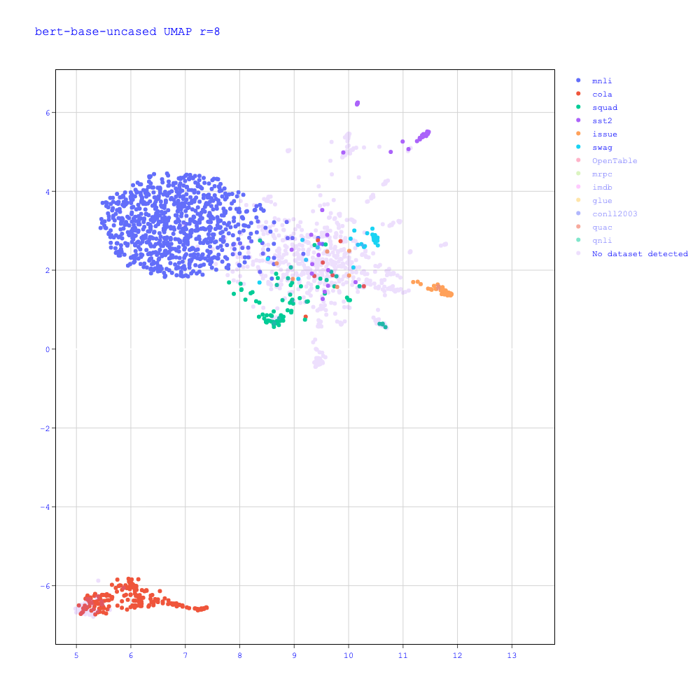
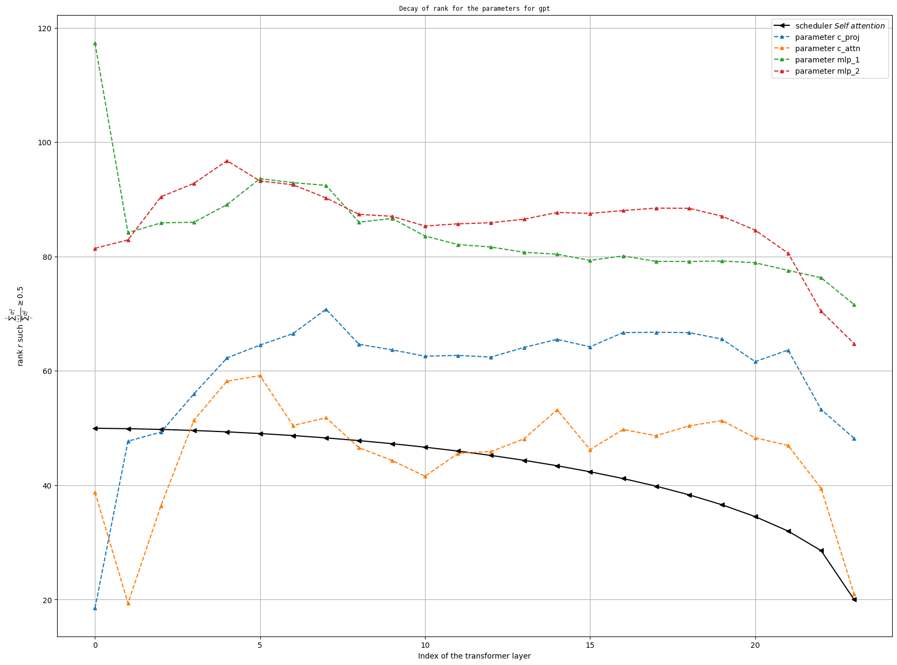

# Vectors

Vectors in the wild

## Project description

How do you represent a Transformer base language model as a vector? We want to derive vector representations of fine-tuned model and see if we can find a way to cluster them. We leverage the following intuition. Fine-tuning a language model amount for turning each of its parameters $W$ into a new parameter $W + \delta W$. It has been demonstrated that $\delta W$ is low rank. In this project, we are working with fine-tuned models and we study the parameters $\delta W$ in order to find a vector representation of each of them.

## Vector representation

The vast majority of language models rely on the transformer architecture. It is an encoder-decoder neural network that was initially build for machine translation tasks before being extended to more use cases. As a matter of fact, in a Transformer Encoder we have :
- An **embedding layer** : It takes as input a sequence of tokens $x = [x_1, \ldots x_n]$ and turn it into a matrix $X \in \mathbb{R}^{n\times d_{model}}$.
- A **self-attention module** : The self-attention module usually works with multi-head attention. It is characterized by 4 matrices :
  - $W_q \in \mathbb{R}^{d_{model}\times d_{model}}$ : It is the matrix of keys. In reality, we can represent it as a matrix in $\mathbb{R}^{h\times d_{model} \times \frac{d_{model}}{h}}$ in order to make it clear that we use multihead attention where $h$ is the number of heads. ($d_k = \frac{d_{model}}{h})$
  - $W_k$ : It is the matrix of keys.
  - $W_v$ : It is the matrix of values
  - $W_o$ : It is the output matrix in multi-head attention. For each head we have $softmax \left ( \frac{XW_q (XW_k)^T}{\sqrt{d_k}} \right )W_v \in \mathbb{R}^{n\times d_k}$. We concatenate each of this output (rows-wise, to obtain a matrix in $\mathbb{R}^{n \times d_{model}}$) and we multiply the result by $W_o$.
- A **feedforward network** : It is characterized by 2 matrices :
  - $W_1 \in \mathbb{R}^{d_{model} \times d_{ff}}$ where either $d_{ff} = 4d_{model}$ or $d_{ff} = \frac{8}{3}d_{model}$ in practice.
  - $W_2 \in \mathbb{R}^{d_{ff} \times d_{model}}$
  - We do not consider the biases (They are not always used in practice either).
  
An Encoder-based model have $L$ layers. We can derive a vector representation by considering a *per-layer representation* and average it on the number of layers. The *per-layer representation* is done by computing a low-rank decomposition (can be done with singular value decomposition) of each of the matrix mentionned with a chosen rank `r`. A matrix $W$ of size $n\times m$ is then converted into a $n \times r$ matrix, which is equivalement to a $nr\times 1$ vector. Finally, the *per-layer representation* is obtained by concatenation the low-rank version of each parameter matrix. It is worth noting that we do pretty much the same with decoder-based models.

When it comes to encoder-decoder models, it is a bit different. The final representation is the concatenation of the encoder representation and the decoder representation. The algorithm is the same as above. The only difference is that the decoder layers need to incorporate the *cross-attention* parameters in the above computation.

## Clustering
Research questions :
- Can we cluster our representation per tasks/fine-tuning datasets?

In order to respond to this question, we can study the following language models :
- [bert-base-uncased](https://huggingface.co/bert-base-uncased)
- [roberta-base](https://huggingface.co/roberta-base)
- [t5-base](https://huggingface.co/t5-base)
- [gpt2-medium](https://huggingface.co/gpt2-medium)

For each of these models, we can find a collection of their fine-tuned version by leveraging the [HfApi](https://huggingface.co/docs/huggingface_hub/package_reference/hf_api). We can then compute a matrix of size *(number of fine-tuned models* $\times$ *size of the representation)*. We can apply any dimensionality reduction technique to that matrix ([Umap](https://umap-learn.readthedocs.io/en/latest/), [t-SNE](https://scikit-learn.org/stable/modules/generated/sklearn.manifold.TSNE.html), [PCA](https://scikit-learn.org/stable/modules/generated/sklearn.decomposition.PCA.html#sklearn.decomposition.PCA) etc.). With a low dimension matrix, it is then possible to plot and observe the clusters. Here is an example of what we obtained on `bert-base-uncased`

It is also possible to compute any metric of interest. For each dataset, we know how many models was fine-tuned on it. Given a fine-tuned model $f$, we have $k-1$ other models fine-tuned on the same dataset in our database. We can compute the $k-1$ closest models to $f$ (in the original space, without dimensionality reduction) and see the proportion of models fine-tuned on f's dataset among those.

## Study the rank
Research questions :
- How does the rank of the parameters of a models as a function of their depth in the network?

For a parameter matrix $W$, we can use singular value decomposition in order to compute its singular values $[\sigma_1 \ldots \sigma_N]$. Given a *threshold*, we can find the value $r$ such that $\frac{\sum_{i=1}^{r}\sigma_i^2}{\sum_{i=1}^{N}\sigma_i^2} \geq threshold$. We can analysize how that value evolve for each parameter family (`query`, `key`, `value`, `output`, `feedforward1`, `feedforward2`) as we go from layer $1$ to layer $L$. We can even derive an equation if we are able to find a pattern. Here is what we obtain with gpt2-medium

## Acknowledgements
This work would not have been possible without Hugging Face.
